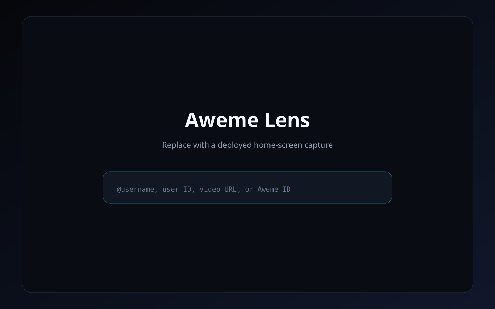
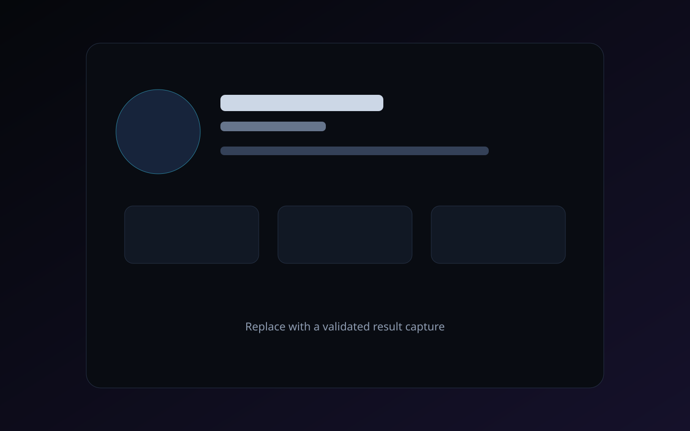

# Aweme Lens

Aweme Lens is a provenance-first TikTok profile and post inspector built with Next.js, TypeScript, React, Tailwind CSS, Zod, and Vitest. It accepts usernames, profile URLs, TikTok video URLs, numeric user IDs, and numeric Aweme IDs; selects an evidence-backed server adapter; validates the exact requested target; and shows normalized fields alongside their original endpoint and JSON paths.

The application is complete and credential-free in **mock mode**. Its **legacy-live mode** is isolated and experimental because the connected endpoint repository contains older request contracts and response types but no current signer. The application does not fabricate current TikTok signing, story lookup, account-origin fields, or a modern `api16` target-feed implementation.





## Features

- Username, `@username`, profile URL, video URL, user ID, and Aweme ID parsing
- Explicit `user:<id>` and `aweme:<id>` prefixes for ambiguous numeric IDs
- TikTok IDs preserved as strings to prevent JavaScript precision loss
- Exact username, user-ID, Aweme-ID, and optional author-UID validation
- Bounded target-missing retries and disclosed numeric fallback
- Separate profile and Aweme adapters behind one orchestrator
- Synthetic success, partial, private, missing, malformed, 403, 429, and timeout fixtures
- Per-field provenance: endpoint, exact upstream path, retrieval time, confidence, origin, and derivation status
- Searchable and copyable sanitized raw JSON
- Recursive secret redaction and volatile signed-URL sanitization
- Request-size limits, timeouts, cooldowns, response caching, and basic IP rate limiting
- Responsive loading, empty, result, partial, and error states
- Browser-local recent searches and accessible keyboard navigation
- `POST /api/lookup` and `GET /api/health`

## Supported inputs

| Input | Example | Resolution |
|---|---|---|
| Username | `example` or `@example` | Exact username search, then profile by permanent user ID |
| Profile URL | `https://www.tiktok.com/@example` | Username lookup |
| Video URL | `https://www.tiktok.com/@example/video/7399999999999999991` | Exact Aweme lookup |
| Explicit user ID | `user:6800000000000000001` | Profile lookup |
| Explicit Aweme ID | `aweme:7399999999999999991` | Post lookup |
| Bare numeric ID | `7399999999999999991` | Likely type first, exact-target fallback when needed |

Bare numeric IDs are ambiguous because both user IDs and post IDs can be long decimal strings. The API reports fallback attempts rather than silently guessing.

## Architecture

```text
Browser
  └── POST /api/lookup
        ├── request schema and rate validation
        ├── input parser
        ├── lookup orchestrator
        │     ├── profileAdapter
        │     └── awemeAdapter
        ├── exact-target validators
        ├── profile/post normalizers
        ├── field provenance builder
        ├── recursive sanitizer
        └── small in-memory cache
```

Client components receive normalized responses only. Environment values, cookies, signer interaction, device identifiers, and upstream request code remain in server-only modules. See [docs/ARCHITECTURE.md](docs/ARCHITECTURE.md).

## Repository evidence

The original connected fork, `hjdfgsgfjshdgfds/tiktok-api`, provided legacy evidence for:

- profile, username-search, Aweme-detail, feed, follower, following, and comment paths
- request parameter ordering
- response shapes and field names
- mocked fixtures and endpoint tests
- `json-bigint` parsing with large integers stored as strings

Its upstream README says it is no longer maintained and targets TikTok 9.1.0-era behavior. It requires a caller-provided `signURL` function plus legacy device values, so the repository does not prove present-day endpoint compatibility.

Two additional repositories were reviewed:

- `huaerxiela/douyin-algorithm` contains older native Douyin signature research. Its README says it is no longer updated, targets Douyin 23.2.0, warns of an SM3 defect, and leaves later signature additions incomplete.
- `edwinjson/tiktok-api` claims mobile and web signatures, but its checked-in examples import missing modules, its `argus.py` is incomplete decompiler-style code, and examples contain hard-coded authentication/session/proxy material that is unsafe to reuse.

Neither inspected tree supplies a licensed, self-contained, tested implementation of the requested modern target-feed lookup. No code from either additional repository is copied. See [EVIDENCE_REPORT.md](EVIDENCE_REPORT.md), [docs/SIGNING_RESEARCH.md](docs/SIGNING_RESEARCH.md), and [THIRD_PARTY_NOTICES.md](THIRD_PARTY_NOTICES.md).

## Capability matrix

| Capability | Mock | Legacy-live | Claim |
|---|---:|---:|---|
| Username → exact profile | Yes | Experimental | No current compatibility claim |
| User ID → profile | Yes | Experimental | No current compatibility claim |
| Video URL / Aweme ID → legacy detail | Yes | Experimental | No current compatibility claim |
| Exact matching inside `aweme_list` | Tested | Validation utility | No modern target-feed request included |
| Story lookup | No | No | Unsupported |
| Modern TikTok signing | No | Operator bridge only | Not included |
| Locked region/account origin | No | No | Omitted because evidence is absent |

## Local setup

Requirements: Node.js 20.11+ and npm 10+.

```bash
npm install
cp .env.example .env.local
npm run dev
```

Open `http://localhost:3000`. `LOOKUP_MODE=mock` is the default and requires no TikTok credentials.

### Useful mock inputs

| Input | Scenario |
|---|---|
| `@example` | Successful profile |
| `@private` | Private profile |
| `@partial` | Partial profile |
| `@unavailable` | Target missing |
| `@malformed` | Malformed upstream response |
| `@forbidden` | 403-equivalent error |
| `@ratelimited` | 429-equivalent error |
| `@timeout` | Timeout |
| `7399999999999999991` | Successful Aweme |
| `7399999999999999992` | Target-missing Aweme |
| `7399999999999999997` | Partial Aweme |
| `6800000000000000001` | Ambiguous numeric ID resolved to profile |

## Experimental legacy-live mode

Legacy-live mode reuses only the old request contract present in the original fork. It is not a current TikTok compatibility guarantee.

```dotenv
LOOKUP_MODE=legacy-live
TIKTOK_LEGACY_BASE_URL=https://api2.musical.ly/
TIKTOK_SIGNER_URL=https://your-server-side-signer.example/sign
TIKTOK_SIGNER_TOKEN=
TIKTOK_DEVICE_ID=
TIKTOK_FP=
TIKTOK_IID=
TIKTOK_OPENUDID=
TIKTOK_COOKIE=
```

The operator-owned signer bridge receives an unsigned URL, timestamp, and device ID and returns a `signedUrl`. Aweme Lens verifies that the result is HTTPS, contains no embedded credentials, retains the exact host and path, and preserves every required unsigned parameter. It cannot redirect the request to another host or change the target identifier.

## Environment variables

| Variable | Default | Purpose |
|---|---|---|
| `LOOKUP_MODE` | `mock` | `mock` or `legacy-live` |
| `ALLOW_RAW_VIEWER` | `true` | Permit sanitized raw output |
| `LOOKUP_BUDGET_MS` | `45000` | End-to-end lookup budget |
| `REQUEST_TIMEOUT_MS` | `8000` | Per-network-call timeout |
| `TARGET_MISSING_RETRIES` | `1` | Additional exact-target retries |
| `CACHE_TTL_SECONDS` | `60` | Successful response lifetime |
| `CACHE_MAX_ENTRIES` | `100` | In-memory cache bound |
| `RATE_LIMIT_MAX` | `30` | Requests per local limiter window |
| `RATE_LIMIT_WINDOW_SECONDS` | `60` | Local limiter window |
| `UPSTREAM_COOLDOWN_SECONDS` | `60` | Cooldown after 403/429 |
| `TIKTOK_LEGACY_BASE_URL` | legacy host | Fixed legacy upstream base |
| `TIKTOK_SIGNER_URL` | unset | Server-side signer bridge |
| `TIKTOK_SIGNER_TOKEN` | unset | Optional bridge credential |
| `TIKTOK_DEVICE_ID`, `TIKTOK_FP`, `TIKTOK_IID`, `TIKTOK_OPENUDID` | unset | Legacy device context |
| `TIKTOK_COOKIE` | unset | Optional server-only cookie |

Environment parsing fails closed when live mode is incomplete.

## API

### `POST /api/lookup`

```json
{
  "query": "@example",
  "includeRaw": false
}
```

Responses include `input`, `entity`, `data`, `fields`, `sources`, `warnings`, `errors`, `retrievedAt`, and metadata such as request ID, adapter, attempt count, validation status, and cache status.

Status mappings cover invalid input, unsupported input, target missing, authentication failure, rate limiting, timeout, malformed upstream data, and internal error. Stack traces are never returned.

### `GET /api/health`

Reports application mode and whether live configuration is complete without exposing secret values.

## Commands

```bash
npm run dev
npm run typecheck
npm run lint
npm run format:check
npm test
npm run check
npm run build
npm start
```

Tests cover parsing, 19-digit precision, unsupported domains, exact target matching, author validation, malformed and empty responses, cooldowns, redaction, URL sanitization, provenance, environment validation, normalization, and mock lookup flows.

## Deployment

1. Import this repository into Vercel.
2. Keep `LOOKUP_MODE=mock` for a credential-free deployment, or configure all legacy-live values in encrypted project settings.
3. Deploy and verify `/api/health`.

The cache and limiter are intentionally in-memory and per warm serverless instance. Use a trusted shared store for globally consistent high-traffic limits.

## Security and provenance

- No arbitrary URL fetching, custom upstream host, custom headers, cookies, proxy, or method override is accepted from the browser.
- Upstream paths are fixed and redirects are not followed.
- Signed URLs, cookies, tokens, device values, and signer headers are redacted.
- Raw viewing is opt-in per request and can be disabled globally.
- `post.region` and `post.author.region` remain distinct and are never presented as account creation country.
- Request/session/carrier/store/proxy regions remain request context, not inspected-account origin.
- Unsupported fields are hidden rather than replaced with plausible placeholders.

See [SECURITY.md](SECURITY.md), [docs/FIELD_PROVENANCE.md](docs/FIELD_PROVENANCE.md), and [docs/RESPONSE_VALIDATION.md](docs/RESPONSE_VALIDATION.md).

## Known limitations

1. The source endpoint evidence is legacy and its tests are mocked.
2. No current signer is included.
3. The modern `api16-normal-useast5.tiktokv.us/aweme/v1/feed/?aweme_id=...` request is documented but hard-disabled because no reproducible implementation was found.
4. Username lookup may require two requests.
5. Bare numeric IDs may require a disclosed fallback.
6. Sanitized signed media URLs may no longer be playable.
7. Mock fixtures are synthetic and are not live TikTok data.
8. In-memory limits are per process/function instance.

## Legal responsibility

Aweme Lens is an independent research interface, not an official TikTok API. Operators are responsible for applicable law, platform terms, privacy obligations, retention rules, and authorization boundaries. Do not use it to access private data, evade controls, or expose captured authentication material.

## License

MIT. See [LICENSE](LICENSE).
