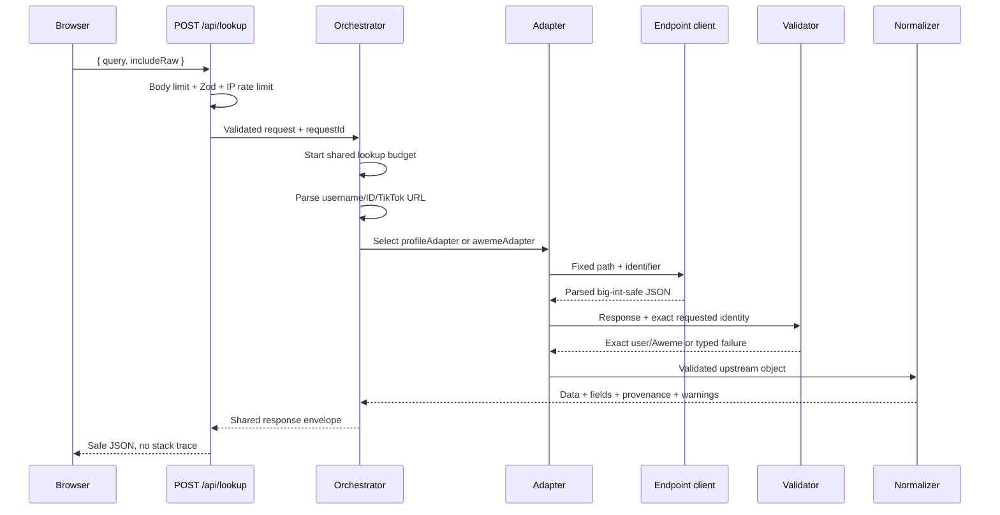

# Architecture

## Goals

Aweme Lens separates four concerns:

1. input interpretation
2. upstream transport
3. requested-target validation and normalization
4. presentation

This prevents the UI from treating an HTTP 200, TikTok `status_code: 0`, or the first item in a response list as proof that the requested target was returned.

## Request flow



## Directory ownership

```text
app/
  api/lookup/route.ts       Transport validation, IP limiter, HTTP response
  api/health/route.ts       Safe operational and evidence report
  layout.tsx                Metadata and global document
  page.tsx                  Server shell and safe public configuration

components/
  lookup-workbench.tsx      Browser form, local recent history, request state
  profile-result.tsx        Profile presentation only
  post-result.tsx           Aweme presentation only
  provenance-panel.tsx      Endpoint and field lineage
  raw-json-viewer.tsx       Search/copy sanitized JSON
  evidence-panel.tsx        Repository capability boundary

lib/
  input-parser.ts           Untrusted query → ParsedInput
  orchestrator.ts           Cache, adapter selection, numeric fallback, envelope
  adapters/                 Profile/Aweme workflows
  http/                     Endpoint-client interface and legacy transport
  mock/                     Synthetic repository-shaped fixtures/client
  validation.ts             Exact identity and response-envelope rules
  normalize/                Upstream object → display data + provenance
  redact.ts                 Recursive raw and URL sanitization
  env.ts                    Server-only environment validation
  cache.ts                  Small successful-result cache
  rate-limit.ts             Basic per-instance IP window
  logger.ts                 Metadata-only structured logs
```

## Adapter contract

Every adapter returns:

- entity type
- normalized data
- field provenance array
- source request array
- warnings
- attempt count
- validation status
- optional sanitized raw data

Adapters throw typed `LookupError` values for expected failure classes. The orchestrator converts errors into the same response envelope used for success.

## Endpoint-client boundary

`EndpointClient` exposes only:

```ts
get(
  path: LegacyPath,
  params: Record<string, string | number | boolean | undefined>,
  options?: { signal?: AbortSignal }
)
```

`LegacyPath` is a compile-time allowlist. User input never supplies a host, path, HTTP method, header, cookie, or proxy.

Two implementations exist:

- `MockTikTokClient`: deterministic synthetic responses and failures
- `LegacyTikTokClient`: server-only HTTPS transport requiring an external signer

The orchestrator creates one end-to-end `AbortController` budget that covers signer calls,
upstream requests, retry delays, and numeric-ID fallback. The signal is forwarded into both
endpoint clients. Each signer and upstream call also has its own shorter timeout.

## Numeric ambiguity

A bare decimal string cannot prove whether it is a TikTok user ID or Aweme ID. The parser selects a likely first type and marks it ambiguous. The orchestrator:

1. executes the first adapter
2. requires an exact-target miss before trying the alternate type
3. does not fall back on authentication errors, rate limiting, timeouts, or internal errors
4. combines request trails and attempt counts
5. adds a visible `numeric_id_disambiguated` warning

Explicit `user:` and `aweme:` prefixes bypass this process.

## Data flow and trust boundaries

```text
Untrusted browser query
  ↓ validation
Parsed identifier
  ↓ fixed adapter path
Untrusted TikTok/synthetic upstream JSON
  ↓ schema + exact target validation
Validated target object
  ↓ normalization + safe media allowlist
Normalized data and provenance
  ↓ recursive raw redaction
Browser response
```

No layer treats upstream JSON as trusted simply because parsing succeeded.

## Cache

The cache stores only successful `LookupExecution` objects after normalization and redaction. Keys include mode, parsed type, normalized value, username context, the effective raw-viewer choice, and whether raw data was requested. Keeping the last two values separate ensures a disabled raw-viewer warning cannot be hidden by a cache entry created by a request that never asked for raw data.

Properties:

- TTL bounded by environment configuration
- maximum entry count
- least-recently-touched eviction when full
- defensive `structuredClone` on get/set
- errors are never cached
- cache hit is disclosed in response metadata

## Rate limiter

The lookup route uses a fixed-window in-memory counter keyed by the first forwarded IP value or real IP header. It returns standard informational headers:

- `X-RateLimit-Limit`
- `X-RateLimit-Remaining`
- `X-RateLimit-Reset`

This is a basic application-instance limit. It must be replaced by a shared datastore for globally consistent enforcement.

## Rendering and bundle boundary

Only `lookup-workbench.tsx` and `raw-json-viewer.tsx` are client components. Result components receive plain normalized data. Server environment, transport, fixtures, validation, and normalization stay out of the browser bundle.

The page uses local SVG mock artwork and system fonts, so mock mode does not require remote asset hosts.
